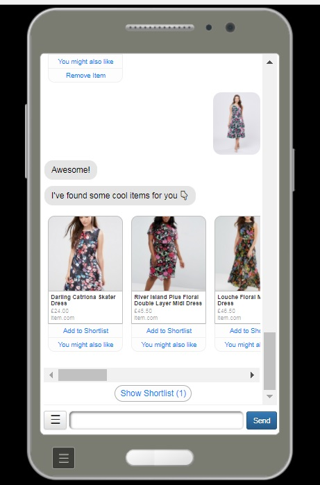

# facebook-send-api-emulator
This is an emulator for Facebook Send API and Facebook Messenger which i have used in chatbot development.
The purpose of using this is to be able to develop and debug facebook web hooks locally.

The emulator provides a local endpoint to mimic Send API functions in form of express rest api.
The messenger emulator is mostly angular application which uses bootstrap for some UI elements.

# HOW to use
Lets say you have a facebook page / bot which is run by your web hook

you need following information in hand before you can use this emulator

* SendApi.WebHookUrl  : Url to your web hook endpoint
* SendApi.PageScopeId : Page Scope Id of your facebook page/app
* SendApi.AppSecret   : App secret of your facebook page/app 
* SendApi.Port        : Port on which this Send API emulator will start (default 3000)

Once you have all these items, add these to your system variables with same names as above.

in command prompt navigate to your folder where you have cloned this repo, run the following commands
>`>webpack`    [this is to build the html ui of the emulator]

>`>npm start`  [this will start your send api emulator]

now you can browse your emulated messenger on http://localhost:<port>]

and you your api (SendAPI / Messenger Platform) will be litening on http://localhost:<port>/v2.6
